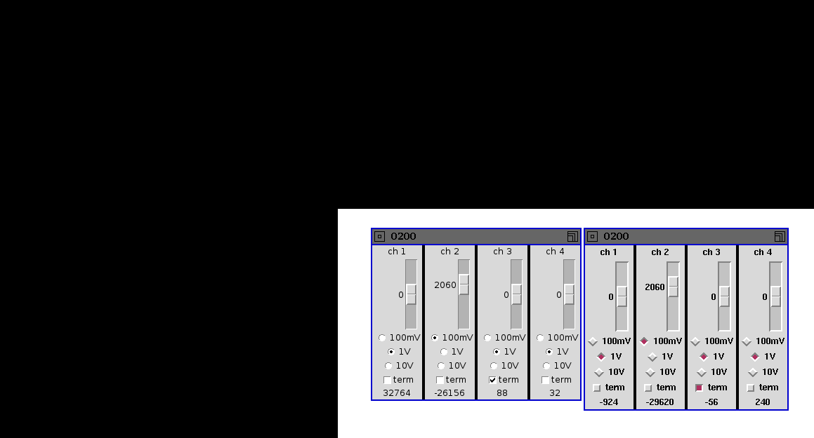

Tools
=====

The driver is distributed with a few tools living in the ``tools/``
subdirectory and they do not use any dedicated library, instead
they do raw accesses to the driver. The programs are meant to provide
examples about the use of the driver interface.

The generic library `adc-lib`_ supports this driver, so you may want to
consider to use the generic tools from that library.

.. _`adc-lib`: http://www.ohwr.org/projects/adc-lib

Trigger Configuration
---------------------

The program ``fau-trg-config`` configures the FMC ADC trigger. The tool
offers command line parameters to configure every register exported by
the driver. The help screen for the program summarizes the options::

     # ./tools/fau-trg-config --help

     fau-trg-config [OPTIONS] <DEVICE>

       <DEVICE>: ZIO name of the device to use
       --pre|-p <value>: number of pre samples
       --post|-P <value>: number of pre samples
       --nshots|-n <value>: number of trigger shots
       --delay|-d <value>: set the ticks delay of the trigger
       --threshold|-t <value>: set internal trigger threshold
       --channel|-c <value>: select the internal channel as trigger
       --external: set to external trigger. The default is the internal trigger.
       --negative-edge: set internal trigger polarity to negative edge. The default
                         is positive edge.
       --enable-sw-trg: enable the software trigger. By default is disabled.
       --disable-hw-trg: disable the hardware trigger. By default is enabled
       --force: force all attribute to the program default
       --help|-h: show this help

     NOTE: The software trigger works only if also hardware trigger is enabled

The tool gets the configuration values from the user and it writes them
to the corresponding sysfs attributes for the specified device. or
example, if you want to configure the board for the external trigger and
3 shots of 10 pre-samples and 100 post-samples, this is the associated
command line::

     # ./tools/fau-trg-config --external --pre 10 --post 100 --re-enable 2 \
             adc-100m14b-0200

As shown, the nshot parameter is passed as a number of re-enables,
because the trigger is initially automatically enabled. This may change
in the future, for better naming consistency with hardware documentation
and across tools.

Acquisition Time
----------------

The program fau-acq-time retrieves the timestamps associated with the
acquisition. This is the help screen of the program::

     ./tools/fau-acq-time --help

     fau-acq-time [OPTIONS] <DEVICE>

       <DEVICE>: ZIO name of the device to use
       --last|-l : time between the last trigger and the acquisition end
       --full|-f : time between the acquisition start and the acquisition end
       --help|-h: show this help

The program can return two different *types* of acquisition time. The
value returned by **last** represent the time elapsed between the last
trigger event and the acquire-end event; this is the time spent during
the last capture.

The value returned by **full** is the time elapsed between the
acquisition start event and the acquisition end event, i.e. the total
time spent waiting for all trigger events and the time spent acquiring
all samples.

Channel Configuration
---------------------

The program ``tools/fau-config-if`` is a simple graphic tool that allow to
select offset and range for the four channels, activate termination and
see the current value of each channel, every 500ms.

The program open one window for each detected card, and configures it by
writing to sysfs. Such writes are also reported to stdout (in the
terminal where you invoked the program), so you can easily copy the
pathnames in your shell commands.

The figure below shows two instances of the tool, running on the same card
with device_id 0x200 (your window decorations will be different, according
to your choice of window manager or desktop environment).
The first one (at the left) is running under Tk-8.5; the second one shows
the graphic appearance of Tk-8.4 (and earlier versions). If you prefer the
older one, run *wish8.4 tools/fau-config-if* instead of
``tools/fau-config-if`` (or set the previous version as default Tk interpreter).

Parallel Port Burst
-------------------

If you have a Parallel Port you can use it to generate bursts of pulses
with a software program. This may be useful to test the external
trigger; you can connect the parallel port to the external trigger of
the FMC ADC and generate your trigger events with this program

The program parport-burst, part of this package, generates a burst
according to three command line parameters: the I/O port of the data
byte of the parallel port, the repeat count and the duration of each
period. This example makes 1000 pulses of 100 usec each, using the
physical address of my parallel port (if yours is part of the
motherboard, the address is ``378``)::

    ./tools/parport-burst dd00 1000 100
