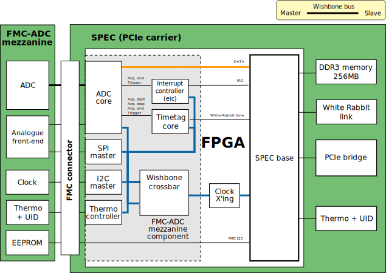
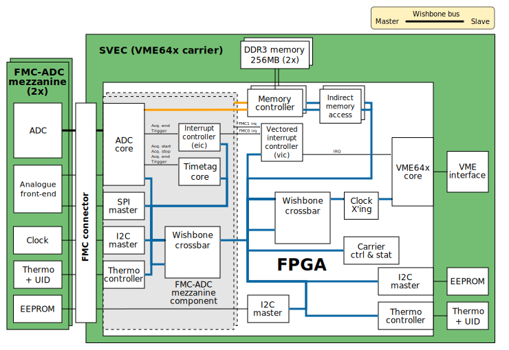
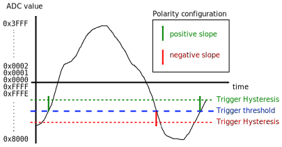
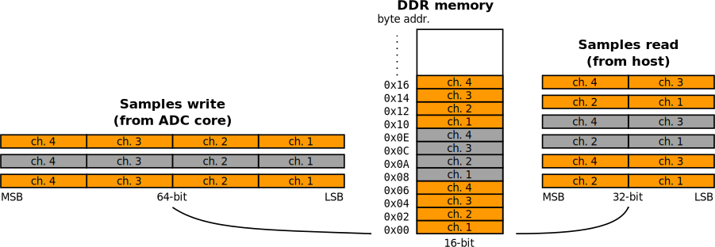
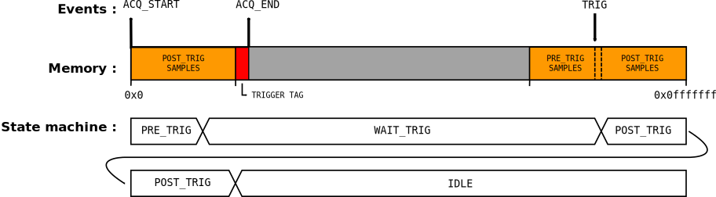

..
  SPDX-License-Identifier: CC-BY-SA-4.0
  SPDX-FileCopyrightText: 2020 CERN

============
The Gateware
============

About Source Code
=================

Build from Sources
------------------

The fmc-adc hdl design make use of the ``hdlmake`` tool. It
automatically fetches the required hdl cores and libraries. It also
generates Makefiles for synthesis/par and simulation.

Here is the procedure to build the FPGA binary image from the hdl
source.::

  # Install ``hdlmake`` (version 3.4).
  # Get fmc-adc hdl sources.
  git clone git://ohwr.org/project/fmc-adc-100m14b4cha.git <src_dir>

  # Goto the synthesis directory.
  cd <src_dir>/hdl/<carrier>/syn/

  # Fetch the dependencies and generate a synthesis Makefile.
  hdlmake

  # Perform synthesis, place, route and generate FPGA bitstream.
  make

Source Code Organisation
------------------------

hdl/rtl/
    ADC specific hdl sources.

hdl/cheby/
    ADC specific ``cheby`` sources, html documentation and C header
    file.

hdl/ip_cores/
    Location of fetched hdl cores and libraries.

hdl/platform/<platform>
    Platform related hdl sources.

hdl/top/<design>
    Top-level hdl module for selected design.

hdl/syn/<design>
    Synthesis directory for selected design. This is where the
    synthesis top manifest, the design constraints and the ISE project
    are stored. For each release, the synthesis, place&route and timing
    reports are also saved here.

hdl/testbench/
    Simulation files and testbenches.

Dependencies
------------

The fmc-adc gateware depends on the following hdl cores and libraries:
`General Cores`_, `DDR3 SP6 core`_, `GN4124 core`_ (SPEC only),
`SPEC`_ (SPEC only) `VME64x Slave`_ (SVEC only), `SVEC`_ (SVEC only),
`WR Cores`_.

These dependencies are managed with GIT submodules. Whenever you checkout
a different branch remember to update the submodules as well.::

  git submodule sync
  git submodule update

Architecture
============

This chapter describes the internal blocks of the FPGA for both SPEC
(PCIe) and SVEC (VME64x) carriers. The gateware is designed around one
or several `OpenCores Wishbone`_ bus interconnects.

SPEC (PCIe carrier)
-------------------

In the PCIe version of the gateware, all blocks (except the memory
controller) are connected to the PCIe bridge interface using the same
Wishbone bus (*main* bus). The ADC samples are written and read
to/from the DDR memory using separate Wishbone bus interconnects. Due
to its size, the DDR memory is not mapped on the *main* Wishbone bus
and can only be accessed through DMA. The following figure illustrates
the fmc-adc gateware architecture on the SPEC carrier. A crossbar that
is automatically generated by `cheby` is used to map the slaves in the
Wishbone address space.

   FMC-ADC gateware architecture on SPEC carrier.

There are three different Wishbone bus interconnects in the design.

Mapped WB bus (blue)
  This bus connects all the peripherals to the GN4142 core.
  Data: 32-bit, address: 32-bit (word aligned), clock: system clock (125MHz).

ADC core to memory controller (orange)
  This bus is used to write samples from the ADC core to the DDR memory.
  Data: 64-bit, address: 32-bit (word aligned), clock: system clock (125MHz).

Note that some of the cores from the `General Cores`_ library are
based on cores from `OpenCores`_. Therefore, the documentation for
those cores is hosted on the OpenCores website.

Clock Domains
~~~~~~~~~~~~~

The SPEC version of the fmc-adc design has five different clock domains.
They are listed in the following table.

+-----------------+-----------------+-----------------+-----------------+
| Name            | Description     | Frequency       | Source          |
+=================+=================+=================+=================+
| ``sys_clk_125`` | Main system     | 125.00 MHz      | 20MHz TCXO      |
|                 | clock           |                 | (carrier)       |
+-----------------+-----------------+-----------------+-----------------+
| ``ddr_clk``     | DDR interface   | 333.33 MHz      | 20MHz TCXO      |
|                 | clock           |                 | (carrier)       |
+-----------------+-----------------+-----------------+-----------------+
| ``fs_clk``      | Sampling clock  | 100.00 MHz      | 400MHz LTC2174  |
|                 |                 |                 | (mezzanine)     |
+-----------------+-----------------+-----------------+-----------------+
| ``serdes_clk``  | ADC data        | 800.00 MHz      | 400MHz LTC2174  |
|                 | de-serialiser   |                 | (mezzanine)     |
|                 | clock           |                 |                 |
+-----------------+-----------------+-----------------+-----------------+
| ``p2l_clk``     | Local bus clock | 200.00 MHz      | 200MHz GN4124   |
|                 |                 |                 | (carrier)       |
+-----------------+-----------------+-----------------+-----------------+

SVEC (VME64x carrier)
---------------------

In the VME64x version of the gateware, all blocks are connected to the
VME64x core using a single Wishbone bus. Here the DDR memory is not
accessed through DMA, but using a indirect addressing scheme explained
later in `DDR Memory Controller <#DDR-Memory-Controller>`__. A crossbar that
is automatically generated by `cheby` is used to map the slaves in the
Wishbone address space.

   FMC-ADC gateware architecture on SVEC carrier.

There are three different Wishbone bus interconnects in the design.

Mapped WB bus (blue)
  This bus connects all the peripheral to the VME64x core.
  Data: 32-bit, address: 32-bit (word aligned),
  Clock: system clock (125MHz) and system clock / 2 (62.5MHz), see note below.

ADC cores to memory controllers (2x, orange)
  These two buses are used to write samples from the ADC cores to the DDR
  memories.
  Data: 64-bit, address: 32-bit (word aligned), clock: system clock (125MHz).

.. note::
   The VME64x core cannot work with a clock frequency as high as
   125MHz, therefore it is clocked with half the system clock
   frequency. As the fmc-adc core needs 125MHz to work properly, a
   Wishbone clock crossing component is inserted between the VME64x core
   and the first Wishbone crossbar component. With this topology, only
   the VME64x core runs at a lower frequency.

Clock Domains
~~~~~~~~~~~~~

The SVEC version of the fmc-adc design has five different clock domains.
They are listed in the following table.

+-----------------+-----------------+-----------------+-----------------+
| Name            | Description     | Frequency       | Source          |
+=================+=================+=================+=================+
|   sys_clk_125   | Main system     | 125.00 MHz      | 20MHz TCXO      |
|                 | clock           |                 | (carrier)       |
+-----------------+-----------------+-----------------+-----------------+
|   sys_clk_62_5  | System clock /  | 62.50 MHz       | 20MHz TCXO      |
|                 | 2               |                 | (carrier)       |
+-----------------+-----------------+-----------------+-----------------+
|   ddr_clk       | DDR interface   | 333.33 MHz      | 20MHz TCXO      |
|                 | clock           |                 | (carrier)       |
+-----------------+-----------------+-----------------+-----------------+
|   fs_clk        | Sampling clock  | 100.00 MHz      | 400MHz LTC2174  |
|                 |                 |                 | (mezzanine)     |
+-----------------+-----------------+-----------------+-----------------+
|   serdes_clk    | ADC data        | 800.00 MHz      | 400MHz LTC2174  |
|                 | de-serialiser   |                 | (mezzanine)     |
|                 | clock           |                 |                 |
+-----------------+-----------------+-----------------+-----------------+

Common Cores
------------

DDR Memory Controller
~~~~~~~~~~~~~~~~~~~~~

The memory controller block is the interface between the 256MB DDR3
memory located on the carrier boards and the other blocks in the FPGA.
It is basically a MCB core (Memory Controller Block) generated with
`Xilinx CoreGen`_ and an additional wrapper implementing two Wishbone
slave interfaces.

One of the Wishbone slave interfaces is connected to the ADC core. In
the SPEC gateware, the other Wishbone slave interface is connected to
the DMA Wishbone master of the GN4124 core. In the SVEC gateware, the
other slave Wishbone interface is connected to an indirect addressing
block.

This block consists of an address pointer register and a data FIFO. To
access the DDR memory, the gateware sets the address pointer and then
reads/writes data using the FIFO. On each access to the FIFO, the
address pointer is automatically incremented.

+----------+-------------+------------+-------------+
| WB Slave | Description | Data width | Access type |
+==========+=============+============+=============+
| ``0``    | ADC core    | 64-bit     | Write only  |
+----------+-------------+------------+-------------+
| ``1``    | host side   | 32-bit     | Read/write  |
+----------+-------------+------------+-------------+

The memory controller side connected to the chip is 16-bit wide, clocked
at 333.33 MHz DDR. This gives a maximum bandwidth of 1333.33 MB/s. Each
of the four ADC channels requires 200 MB/s (16-bits per sample, 100
MHz), for a total of 800 MB/s.

In the current design, the two Wishbone ports have the same priority and
the arbitration is done with a simple round-robin. Therefore, samples
stored in the DDR memory should not be read during an acquisition.

FMC-ADC Core
------------

The ADC core is the main block of the design. On the mezzanine interface
side, it takes a data flow from the `LTC2174`_ ADC chip, an external
trigger and controls the analogue switches to select the input range or
calibration mode. On the internal interface side, it has a Wishbone
master to write data to the DDR memory controller. It also has a
Wishbone slave to access the internal components.

The internal detailed functioning of this block is described further in
the document (See `Configuration`_, `Calibration`_ and `Acquisition`_).

Sampling clock
~~~~~~~~~~~~~~

The sampling frequency is determined by a `Si570`_ programmable oscillator
located on the fmc-adc mezzanine. By default, the sampling clock is
100MHz (oscillator factor default value), but it can be changed to any
frequency from 10MHz to 105MHz. The lower bound is defined by the Si570
oscillator while the upper bound is limited by the LTC2174 ADC itself.

The Si570 clock output is connected to the LTC2174 ADC. Then the data
clock (DCO) output of the LTC2174 is connected to the FPGA. The data
clock is four times the sampling clock. The sampling clock (``fs_clk``)
and the ADC data de-serialiser clock (``serdes_clk``) are derived from
the data clock using a PLL (internal to the FPGA).

**Note:** The internal PLL expects a 400MHz input frequency (define in
the hdl code), therefore the sampling frequency has to be 100MHz and
can’t be changed dynamically.

The ADC core implements a sampling clock frequency meter. The measured
frequency (in Hz) can be read via a register (see :doc:`memory-map`).

Time-tagging Core
~~~~~~~~~~~~~~~~~

This block allows time-tagging of important events in the ADC core. It
is based on two free-running counters; a seconds counter and a 125MHz
system clock ticks counter. The system clock ticks counter is also
called coarse counter. These two counters are accessible in read/write
via a Wishbone interface.

For example, the host computer can use the OS time to set the seconds
counter and simply reset the coarse counter. It is planned, in a later
release, to set the time-tagging core counters using the White Rabbit
core.

A time-tag is made of four 32-bit words; meta-data, seconds, coarse,
fine. The fine field is always set to zero and the meta-data register
does not contain useful information, only random data for debugging
purposes.

The following events are time-tagged:

- Trigger
- Acquisition start
- Acquisition stop
- Acquisition end

.. note::
   The trigger time tag corresponds to the moment when the acquisition
   state machine leaves the ``WAIT_TRIG`` state.

.. note::
   The trigger time-tag is also stored in the data memory, after the
   post-trigger samples. This allows to always have a trigger time-tag,
   even in multi-shot mode (retrieving the time-tag using the trigger
   interrupt was not fast enough in certain cases).

.. note::
   If during an acquisition no stop command is issued (normal case),
   the acquisition stop time-tag is not updated.

The register description can be found in :doc:`memory-map`.

FMC-ADC Control and Status Registers
~~~~~~~~~~~~~~~~~~~~~~~~~~~~~~~~~~~~

This block contains control and status registers related to the fmc-adc
core. The registers description can be found in :doc:`memory-map`.

Mezzanine SPI Master
~~~~~~~~~~~~~~~~~~~~

This SPI master controls the LTC2174 ADC and the four MAX5442 offset
DACs. The following table shows how the peripherals are wired to the
core. This block is based on an OpenCores design.

+------------------+---------------------------+
| SPI slave select | Peripheral                |
+==================+===========================+
| ``0``            | LTC2174 ADC               |
+------------------+---------------------------+
| ``1``            | MAX5442 DAC for channel 1 |
+------------------+---------------------------+
| ``2``            | MAX5442 DAC for channel 2 |
+------------------+---------------------------+
| ``3``            | MAX5442 DAC for channel 3 |
+------------------+---------------------------+
| ``4``            | MAX5442 DAC for channel 4 |
+------------------+---------------------------+

This block is clocked by the system clock (125 MHz). Therefore for a
SCLK of ~620 kHz, the divider configuration is ``DIVIDER=100``.

::

   f_sclk = f_sys / ((DIVIDER+1) * 2)

Mezzanine 1-wire Master
~~~~~~~~~~~~~~~~~~~~~~~

.. note::
   FIXME talk about the themometer core in general-cores

Mezzanine I2C Master
~~~~~~~~~~~~~~~~~~~~

This I2C master controls the Si570 programmable oscillator chip
located on the mezzanine board. This chip is used to produce the ADC
sampling clock. This block is based on an OpenCores design.

+-------------------+-------------------------------+
| I2C slave address | Peripheral                    |
+===================+===============================+
| ``0x55``          | Si570 programmable oscillator |
+-------------------+-------------------------------+

This block is clocked by the system clock (125 MHz). Therefore for a SCL
clock of 100 kHz, the prescaler configuration is ``PRESCALER=249``.

::

   PRESCALER = f_sys / (5 * f_scl) - 1

FMC-ADC Embedded Interrupt Controller (EIC)
~~~~~~~~~~~~~~~~~~~~~~~~~~~~~~~~~~~~~~~~~~~

The fmc-adc EIC gathers the interrupts from the ADC core. There are two
inputs to the fmc-adc EIC.

Trigger
   This interrupt signals that a valid trigger arrived while the
   acquisition state machine was in the ``WAIT_TRIG`` state.

Acquisition end
   This interrupt signals the end of an acquisition. In case of
   multi-shot acquisition, it occurs at the end of the last shot.

The two inputs are multiplexed and the result is forwarded to the
``spec-base`` (on `SPEC`_) or ``svec-base`` (on `SVEC`_).  (See
`SPEC`_ or `SVEC`_ documentation). Interrupt sources can be masked
using the enable and disable registers. An interrupt is cleared by
writing a one to the corresponding bit of the status register.

The registers description can be found in :doc:`memory-map`.

Configuration
-------------

The following figure is a block diagram of the ADC core part in the
sampling clock domain. It contains an ADC data stream de-serialiser,
an offset and gain correction block (for ADC data), an under-sampling
block and a trigger unit. The four channels’ data and the trigger
signal are synchronised to the system clock domain using a FIFO. The
configuration signals coming from registers in the system clock domain
are synchronised to the sampling clock within the Wishbone slave.

.. figure:: ../fig/adc_core_fs_clk.svg
   :alt: ADC core diagram (sampling clock domain)

   ADC core diagram (sampling clock domain).

The LTC2174 is by default configured in *2-Lane Output Mode, 16-Bit
Serialization*. In the fmc-adc application, this default configuration
is kept. Following an extract from the LTC2174 datasheet illustrating
the *2-Lane Output Mode, 16-Bit Serialization* waveforms.

.. figure:: ../fig/ltc2174_mode.pdf
   :alt: LTC2174 data output mode waveforms.

   LTC2174 data output mode waveforms.

There are two 800Mbit/s lanes per ADC channel. Eight data lanes in
total and the frame rate (FR) lane are fed to a de-serialiser in the
FPGA. The frame rate signal is used to align the de-serialiser to data
words. The four channel data (16-bit) are concatenated together to
form a 64-bit vector. As shown in the figure above, the two LSB bits
of a data word are always set to zero.

.. warning::
   Upon reset the ADC defaults to “offset binary” representation for
   the channel data. However, the ADC core expects “two’s
   complement”. Therefore, it is important to change the relevant
   configuration register in the ADC itself. When using the provided
   FMC-ADC driver, this is done automatically during driver initialisation.

Control and Status Registers
~~~~~~~~~~~~~~~~~~~~~~~~~~~~

Writing one to the ``FMC_CLK_OE`` field of the ADC core control
register enables the sampling clock (Si570 chip). Also, in order to use
the input offset DACs, the ``OFFSET_DAC_CLR_N`` field must be set to
one.

The field ``MAN_BITSLIP`` allows to ’manually’ control the ADC data
alignment in the de-serialiser. When ``TEST_DATA_EN`` is set, the ADC
core writes the address pointer to the memory instead of the ADC
samples. The fields ``TRIG_LED`` and ``ACQ_LED`` allows to control the
FMC front panel LEDs. Those four fields are for test purpose only and
must stay zero in normal operation.

When the sampling clock is enabled, the ``SERDES_PLL`` and
``SERDES_SYNCED`` field from the ADC core status register must be set
to one.

Input Ranges
~~~~~~~~~~~~

This figure shows a simplified schematic diagram of the analogue input
stage used for each channel.

.. figure:: ../fig/analogue_input.pdf
   :alt: Simplified schematic diagram of the analogue input stage

   Simplified schematic diagram of the analogue input stage.

Each input can be independently configured with one of the three
available ranges; 100mV, 1V, 10V. Each range is defined as the maximum
peak-to-peak input voltage. Independently to the selected range, a
50ohms termination can be added to each input.

In addition to the three ranges for normal operation, there are three
more configurations used for offset calibration of each range.

Opto-isolated analogue switches are used to apply the various
configurations. They are represented by standard switch symbols in the
simplified schematic.

Only the following input switch configurations are valid. For all others
switch configurations, the behavior is not defined and therefore
shouldn’t be used.

+---------+-----+-----+-----+-----+-----+-----+-----+--------------------------------+
| SW[7.1] | SW7 | SW6 | SW5 | SW4 | SW3 | SW2 | SW1 | Description                    |
+=========+=====+=====+=====+=====+=====+=====+=====+================================+
| 0x23    | OFF | ON  | OFF | X   | OFF | ON  | ON` | 100mV range                    |
+---------+-----+-----+-----+-----+-----+-----+-----+--------------------------------+
| 0x11    | OFF | OFF | ON` | X   | OFF | OFF | ON` | 1V range                       |
+---------+-----+-----+-----+-----+-----+-----+-----+--------------------------------+
| 0x45    | ON  | OFF | OFF | X   | ON  | OFF | ON` | 10V range                      |
+---------+-----+-----+-----+-----+-----+-----+-----+--------------------------------+
| 0x42    | ON  | OFF | OFF | X   | OFF | ON  | OFF | 100mV range offset calibration |
+---------+-----+-----+-----+-----+-----+-----+-----+--------------------------------+
| 0x40    | ON  | OFF | OFF | X   | OFF | OFF | OFF | 1V range offset calibration    |
+---------+-----+-----+-----+-----+-----+-----+-----+--------------------------------+
| 0x44    | ON  | OFF | OFF | X   | ON  | OFF | OFF | 10V range offset calibration   |
+---------+-----+-----+-----+-----+-----+-----+-----+--------------------------------+
| 0x00    | X   | OFF | OFF | OFF | X   | X   | OFF | Input disconnected             |
+---------+-----+-----+-----+-----+-----+-----+-----+--------------------------------+
| 0x08    | X   | X   | X   | ON` | X   | X   | X`` | 50ohm termination              |
+---------+-----+-----+-----+-----+-----+-----+-----+--------------------------------+

Input Offset
~~~~~~~~~~~~

Each channel has a 16-bit DAC allowing to apply a dc offset to the input
signal. The voltage range of the DAC is 10V (-5V to +5V) and is
independent from the selected input range. The following equation shows
how to convert a digital value written to a DAC to an offset voltage.

::

    v_dac = (v_ref * d_dac/0x8000) - v_ref
    Where:
    v_ref = DAC's voltage reference = 5V
    d_dac = Digital value written to the DAC
    v_dac = DAC voltage

    Example:
    0xFFFF =>  4.999V
    0x8000 =>  0.000V
    0x0000 => -5.000V

The following equation shows the relation between the input voltage and
the offset (applied by the DAC). Note that the offset from the DAC is
subtracted from the input voltage.

::

    v_out = v_in - v_dac
    Where:
    v_in  = Input voltage
    v_dac = DAC voltage
    v_out = Output voltage (to filter and ADC)

Trigger
~~~~~~~

The trigger unit is made of two hardware and one software sources. The
hardware and software paths can be enabled independently. The two paths
are then or’ed together to drive a delay generator. The delay generator
allows to insert a predefined number of sampling clock periods before
the trigger is forwarded to the acquisition state machine. the next
figure shows a simplified digram of the trigger unit.

   Trigger unit diagram.

The hardware trigger source can be either internal (based on an ADC
input channel) or external (dedicated trigger input). For both internal
and external hardware triggers, the polarity can be selected between
positive and negative slope (resp. rising and falling edge). By default
the polarity is set to positive slope.

The external trigger input is synchronised to the sampling clock. The
external trigger pulse must be at least one sampling clock cycle wide.

To use the internal trigger source, both the ADC input channel and the
threshold should be configured. By default, channel 1 is selected and
the threshold is set to 0. Note that the threshold is 16-bit signed
(two’s complement). This figure sketches the internal hardware trigger
threshold behavior.

   Internal hardware trigger threshold.

Furthermore, a glitch filter can be applied to the threshold detection.
The glitch filter is useful to trigger on noisy signals. In order to
help setting the glitch filter, an internal trigger test mode can be
activated. When the test mode is enabled, data from channels 2, 3 and 4
is replaced as follow:

+-----------+--------------------------------------+
| Channel 2 | Input signal over threshold          |
+-----------+--------------------------------------+
| Channel 3 | Input signal over threshold filtered |
+-----------+--------------------------------------+
| Channel 4 | Trigger                              |
+-----------+--------------------------------------+

The software trigger source consists of a pulse generated when a write
cycle is detected on the *Software trigger* register. For further
information on the trigger configuration registers see `ADC Core
Registers <#ADC-Core-Registers>`_.

Undersampling
~~~~~~~~~~~~~

The undersampling block is simply validating one in N samples and
forwarding it to the acquisition logic. The number (N) is configured in
the *Sample rate* register. If N > 1, then the trigger pulse is aligned
to the next valid sample. If N = 1 all the samples are valid and
therefore the trigger is always aligned. A value of N = 0 is treated as
N = 1 in the gateware.

Calibration
-----------

Calibration is done once during the production tests. It can be repeated
afterwards with the production test suite (PTS) and the corresponding
testbench. The calibration process gives the following four values per
channel and per input range:

- ADC gain correction
- ADC offset correction
- DAC gain correction
- DAC offset correction

Note that the temperature during the calibration process is also
measured. This could be used for later temperature compensated
calibration value computing.

Calibration data storage
~~~~~~~~~~~~~~~~~~~~~~~~

All the calibration values are stored in the FmcAdc100m14b4cha EEPROM
(`24AA64`_).  In addition to the calibration values, the EEPROM also
contains mandatory IPMI records specified in the FMC Standard VITA
57.1.

+-------------+-----------+-----------+---------------------+
| Byte offset | File name | File Type | Description         |
+=============+===========+===========+=====================+
| ``0x0``     | IPMI-FRU  | binary    | IPMI records        |
+-------------+-----------+-----------+---------------------+
| ``0x100``   | calib     | binary    | Calibration values  |
+-------------+-----------+-----------+---------------------+

Calibration Data Usage
~~~~~~~~~~~~~~~~~~~~~~

ADC Calibration
^^^^^^^^^^^^^^^

Two registers per channel are implemented in the FPGA for ADC gain and
offset correction. When an input range is selected, the corresponding
gain/offset correction values must be loaded from the EEPROM to those
registers.

.. figure:: ../fig/offset_gain_corr.svg
   :alt: ADC offset and gain correction block

   ADC offset and gain correction block.

The offset register takes a 16-bit signed value. The gain register takes
a 16-bit fixed point value. The fixed point format is as follow:

.. figure:: ../fig/adc_gain_format.svg
   :alt: ADC gain register format

   ADC gain register format.

After the offset and gain corrections are applied, the signal is
saturated to a user-programmable value. One register per channel allows
to set the saturation value. The saturation register takes a 15-bit
unsigned value. From this value, two ’symmetrical’ 16-bit signed numbers
are derived and taken as the saturation boundaries.

.. warning::
   Because the default value (on FPGA start-up) is not
   configurable in cheby, the gain, offset and saturation registers are
   set to 0x0 at start-up. Therefore, the driver has to initialise those
   registers.

.. note::
   After gain and offset correction, the two LSB of the data words can
   be different from zero.

.. note::
   It is usually the driver’s task to read the calibration data
   from the FMC EEPROM and load them to the corresponding registers. This
   has to be done once at start-up and then every time the input range is
   changed.

DAC Calibration
^^^^^^^^^^^^^^^

The DAC value is only set once before an acquisition. Therefore, there
is no need to implement the gain and offset correction in the FPGA. The
software controlling the fmc-adc must apply the DAC gain and offset
correction prior to writing a value to the DAC. As for the ADC
correction values, there is one pair (offset, gain) of DAC correction
values per input range.

Below is the formula to calculate the corrected DAC value (applying gain
and offset correction):

::

    c_val = ((val + offset) * gain/0x8000) + 0x8000
    where:
    c_val  = corrected value to write to DAC (16-bit unsigned)
    val    = value from user (16-bit signed)
    offset = DAC offset calibration value from EEPROM (16-bit signed)
    gain   = DAC gain calibration value from EEPROM (16-bit fixed point)

Acquisition
-----------

This chapter describes the two modes of acquisition, single-shot and
multi-shot. It also explains how the software is expected to control the
fmc-adc acquisitions.

The heart of the acquisition logic is a state machine driven by user
commands (start, stop), the trigger signal and counters events
(e.g. pre-trig done, etc...). The ADC samples are routed along a
datapath (bold arrows), which depends on the acquisition mode.  It is
explained in detail in the `Single-shot Mode`_ and `Multi-shot
Mode`_. The four channels data and the trigger are concatenated
together and fed to a FIFO to be synchronised between the sampling
clock domain and the system clock domain. Even if the LTC2174 ADC is
14-bit, the data of each channel is stored in a 16-bit word. Along the
datapath, we call *sample* a 64-bit vector containing a sample for
each channel. At the output of the ADC core, a flow control FIFO
allows to cope with the memory controller temporary unavailabilities
(due to DDR refresh cycles).

.. figure:: ../fig/adc_core_sys_clk.svg
   :alt: Acquisition logic diagram (system clock domain)

   Acquisition logic diagram (system clock domain).

Samples are stored interleaved in the DDR memory. `Figure
6.2 <#fig_003amem_005fsamples>`__ illustrates the way samples are
written, stored and read in the DDR memory. The DDR memory size is 2Gb
or 256MB.

.. note::
   This means that the maximum number of samples that can be stored is
   128M (\ *2^{27}*16*).

   Illustration of samples storage in DDR memory.

The acquisition process is driven by a state machine.  At
start-up (system reset), the state machine is ``IDLE``, waiting for an
acquisition start command (``ACQ_START``). Commands are sent to the
state machine by writing in the ``FSM_CMD`` field of the control
register (the registers description can be found in :doc:`memory-map`).

.. figure:: ../fig/acq_fsm.svg
   :alt: Acquisition state machine

   Acquisition state machine.

When a start command is received, the state machine goes to ``PRE_TRIG``
and stays in this state until the programmed number of pre-trigger
samples are recorded. After that, it goes in ``WAIT_TRIG`` state and
continue recording sample to memory. If the number of programmed
pre-trigger samples is zero, the state machine skips the ``PRE_TRIG``
state and it foes directly to ``WAIT_TRIG``. When a valid trigger is
detected, the state machine moves to ``POST_TRIG``. It will stay in this
state until the programmed number of post-trigger samples is reached.
The next state is ``TRIG_TAG`` where the trigger time-tag (4x 32-bit
word) is pushed after the last post-trigger sample (to be stored in DDR
memory). When the trigger time-tag has been pushed (two clock cycles),
the state machine goes to ``DECR_SHOT``. From ``DECR_SHOT`` it either
goes back to ``IDLE`` if the number of shots is reached or it repeats
the same cycle for the next shot.

When the acquisition is finished (state machine back to ``IDLE``) and
all samples have been written to the DDR memory, only then the software
can retrieve the samples using DMA transfer. An interrupt is generated
when the acquisition ends.

.. note::
   Start commands are taken into account only in ``IDLE`` state.

.. note::
   Triggers are taken into account only in ``WAIT_TRIG`` state.

.. note::
   A stop command will bring the state machine back to ``IDLE`` from any state.

.. note::
   After a stop command, no end of acquisition interrupt is generated.

There are two LEDs on the fmc-adc front panel. The LED labeled ``ACQ``
is turned ON when the acquisition state machine is **not** in the
``IDLE`` state. The LED labeled ``TRIG`` flashes when a valid trigger is
detected **and** the acquisition state machine is in the ``WAIT_TRIG``
state.

.. note::
   The number of pre-trigger sample can be zero, but there **must** be
   at least one post-trigger sample.

.. note::
   In addition to the requested pre/post-trigger samples, an
   additional sample, corresponding to the trigger, will be recorded.

.. note::
   The start of an acquisition is prohibited if either the number of
   shots or the number of post-trigger samples is equal to zero.

Single-shot Mode
~~~~~~~~~~~~~~~~

The procedure below lists the different steps of a single-shot
acquisition process.

#. Configure acquisition (trigger, number of samples, interrupts, etc...).
#. Issue a start acquisition command (the acquisition state machine must
   be ``IDLE``).
#. When a valid trigger is detected, an interrupt is generated (if enabled).
#. At the end of the acquisition, another interrupt is generated.
#. Read trigger position register.
#. Configure the DMA to retrieve data.
#. Start the DMA transfer (the acquisition state machine must be ``IDLE``).
#. When the DMA transfer is done, an interrupt is generated.
#. The board is ready for a new acquisition start command.

In single-shot mode, the DDR memory is used as a circular buffer. When
the acquisition starts, samples are directly written to the DDR memory
(via FIFOs). The acquisition logic stops writing to the memory when the
configured number of pre/post-trigger samples is reached. It could
happen that the write pointer reaches the top of the memory before the
end of the acquisition. In this case, the write pointer is reset to
address zero and overwrites previous samples. In order to allow the
software to retrieve the requested samples (around the trigger), the
*Trigger address* register stores the write pointer address at the
trigger moment.

.. note::
   The value stored in the *Trigger address* register is a byte address.

.. note::
   Every new acquisition starts writing at address ``0x0``.

The following two figures illustrate the use of the DDR memory as a
circular buffer. The acquisition state machine is also represented.

   Single-shot mode acquisition example.

   Single-shot mode acquisition example (overlapping DDR memory).

.. note::
   *Orange*: Samples written to memory and read back via DMA.
   *Grey*: Samples written to memory, but not read. *White*: Empty memory
   (or previous acquisition samples).

Multi-shot Mode
~~~~~~~~~~~~~~~

The multi-shot acquisition process is almost identical to the
single-shot one, except that once the acquisition is started it will go
around the state machine as many times as the number of configured
shots. This means that if the board is configured for N shots, it will
generate N trigger interrupts (if enabled) and then another interrupt at
the end of the acquisition. A counter, accessible via a register, shows
the remaining number of shots (the registers description can be found
in :doc:`memory-map`).

Unlike the single-mode acquisition, in multi-shot, the DDR memory is not
used as a circular buffer. Instead, two dual port RAM (dpram) are
implemented inside the FPGA. Those dprams are alternatively used as
circular buffer for each shot. Even shots use dpram0 and odd shots
dpram1.

When a shot is finished, the corresponding dpram samples are written to
the DDR memory. Only the pre-trigger samples, the post-trigger samples
and the trigger time-tag are written. The first shot is written starting
at address ``0x0``. Then the second shot is written right after the
trigger time-tag of the first shot. The following figure shows the
shots organisation in the DDR memory.

   DDR memory usage in multi-shot mode acquisition.

.. note::
   The number of samples per shot stored in memory is equal to:
   number of pre-trigger samples + number of post-trigger samples + 1
   (trigger sample) + 2 (time-tag).

.. note::
   In multi-shot mode, the start of an acquisition is prohibited
   if the number of sample per shot is bigger or equal to the dpram size.

.. note::
   The size of the dprams is configurable during the generation
   of the FPGA bitstream (VHDL generic), but not at runtime. The software
   can retrieve the maximum *allowed* value from the *Multi-shot
   sample depth register* (the registers description can be found in
   :doc:`memory-map`). The value stored in that read-only register
   already takes into account the 2 samples reserved for the time-tag
   (eg. if the actual maximum number of samples allowed is 8000, the
   register will read 7998).

Calibration Data Storage in EEPROM
~~~~~~~~~~~~~~~~~~~~~~~~~~~~~~~~~~

The following table describes the ADC calibration arrangement.

+-----------------+-----------------+-----------------+-----------------+
| Byte offset     | Input range     | Description     | Type            |
+=================+=================+=================+=================+
|   0x00          | 10V             | Offset          | 16-bit signed   |
|                 |                 | correction      |                 |
|                 |                 | channel 1       |                 |
+-----------------+-----------------+-----------------+-----------------+
|   0x02          |                 | Offset          | 16-bit signed   |
|                 |                 | correction      |                 |
|                 |                 | channel 2       |                 |
+-----------------+-----------------+-----------------+-----------------+
|   0x04          |                 | Offset          | 16-bit signed   |
|                 |                 | correction      |                 |
|                 |                 | channel 3       |                 |
+-----------------+-----------------+-----------------+-----------------+
|   0x06          |                 | Offset          | 16-bit signed   |
|                 |                 | correction      |                 |
|                 |                 | channel 4       |                 |
+-----------------+-----------------+-----------------+-----------------+
|   0x08          |                 | Gain correction | 16-bit unsigned |
|                 |                 | channel 1       |                 |
+-----------------+-----------------+-----------------+-----------------+
|   0x0A          |                 | Gain correction | 16-bit unsigned |
|                 |                 | channel 2       |                 |
+-----------------+-----------------+-----------------+-----------------+
|   0x0C          |                 | Gain correction | 16-bit unsigned |
|                 |                 | channel 3       |                 |
+-----------------+-----------------+-----------------+-----------------+
|   0x0E          |                 | Gain correction | 16-bit unsigned |
|                 |                 | channel 4       |                 |
+-----------------+-----------------+-----------------+-----------------+
|   0x10          |                 | Temperature     | 16-bit unsigned |
|                 |                 |                 | \* 0.01°        |
+-----------------+-----------------+-----------------+-----------------+
|   0x12          | 1V              | Offset          | 16-bit signed   |
|                 |                 | correction      |                 |
|                 |                 | channel 1       |                 |
+-----------------+-----------------+-----------------+-----------------+
|   0x14          |                 | Offset          | 16-bit signed   |
|                 |                 | correction      |                 |
|                 |                 | channel 2       |                 |
+-----------------+-----------------+-----------------+-----------------+
|   0x16          |                 | Offset          | 16-bit signed   |
|                 |                 | correction      |                 |
|                 |                 | channel 3       |                 |
+-----------------+-----------------+-----------------+-----------------+
|   0x18          |                 | Offset          | 16-bit signed   |
|                 |                 | correction      |                 |
|                 |                 | channel 4       |                 |
+-----------------+-----------------+-----------------+-----------------+
|   0x1A          |                 | Gain correction | 16-bit unsigned |
|                 |                 | channel 1       |                 |
+-----------------+-----------------+-----------------+-----------------+
|   0x1C          |                 | Gain correction | 16-bit unsigned |
|                 |                 | channel 2       |                 |
+-----------------+-----------------+-----------------+-----------------+
|   0x1E          |                 | Gain correction | 16-bit unsigned |
|                 |                 | channel 3       |                 |
+-----------------+-----------------+-----------------+-----------------+
|   0x20          |                 | Gain correction | 16-bit unsigned |
|                 |                 | channel 4       |                 |
+-----------------+-----------------+-----------------+-----------------+
|   0x22          |                 | Temperature     | 16-bit unsigned |
|                 |                 |                 | \* 0.01°        |
+-----------------+-----------------+-----------------+-----------------+
|   0x24          | 100mV           | Offset          | 16-bit signed   |
|                 |                 | correction      |                 |
|                 |                 | channel 1       |                 |
+-----------------+-----------------+-----------------+-----------------+
|   0x26          |                 | Offset          | 16-bit signed   |
|                 |                 | correction      |                 |
|                 |                 | channel 2       |                 |
+-----------------+-----------------+-----------------+-----------------+
|   0x28          |                 | Offset          | 16-bit signed   |
|                 |                 | correction      |                 |
|                 |                 | channel 3       |                 |
+-----------------+-----------------+-----------------+-----------------+
|   0x2A          |                 | Offset          | 16-bit signed   |
|                 |                 | correction      |                 |
|                 |                 | channel 4       |                 |
+-----------------+-----------------+-----------------+-----------------+
|   0x2C          |                 | Gain correction | 16-bit unsigned |
|                 |                 | channel 1       |                 |
+-----------------+-----------------+-----------------+-----------------+
|   0x2E          |                 | Gain correction | 16-bit unsigned |
|                 |                 | channel 2       |                 |
+-----------------+-----------------+-----------------+-----------------+
|   0x30          |                 | Gain correction | 16-bit unsigned |
|                 |                 | channel 3       |                 |
+-----------------+-----------------+-----------------+-----------------+
|   0x32          |                 | Gain correction | 16-bit unsigned |
|                 |                 | channel 4       |                 |
+-----------------+-----------------+-----------------+-----------------+
|   0x34          |                 | Temperature     | 16-bit unsigned |
|                 |                 |                 | \* 0.01°        |
+-----------------+-----------------+-----------------+-----------------+

The following table describes the DAC calibration arrangement.

+-----------------+-----------------+-----------------+-----------------+
| Byte offset     | Input range     | Description     | Type            |
+=================+=================+=================+=================+
|   0x36          | 10V             | Offset          | 16-bit signed   |
|                 |                 | correction      |                 |
|                 |                 | channel 1       |                 |
+-----------------+-----------------+-----------------+-----------------+
|   0x38          |                 | Offset          | 16-bit signed   |
|                 |                 | correction      |                 |
|                 |                 | channel 2       |                 |
+-----------------+-----------------+-----------------+-----------------+
|   0x3A          |                 | Offset          | 16-bit signed   |
|                 |                 | correction      |                 |
|                 |                 | channel 3       |                 |
+-----------------+-----------------+-----------------+-----------------+
|   0x3C          |                 | Offset          | 16-bit signed   |
|                 |                 | correction      |                 |
|                 |                 | channel 4       |                 |
+-----------------+-----------------+-----------------+-----------------+
|   0x3E          |                 | Gain correction | 16-bit unsigned |
|                 |                 | channel 1       |                 |
+-----------------+-----------------+-----------------+-----------------+
|   0x40          |                 | Gain correction | 16-bit unsigned |
|                 |                 | channel 2       |                 |
+-----------------+-----------------+-----------------+-----------------+
|   0x42          |                 | Gain correction | 16-bit unsigned |
|                 |                 | channel 3       |                 |
+-----------------+-----------------+-----------------+-----------------+
|   0x44          |                 | Gain correction | 16-bit unsigned |
|                 |                 | channel 4       |                 |
+-----------------+-----------------+-----------------+-----------------+
|   0x46          |                 | Temperature     | 16-bit unsigned |
|                 |                 |                 | \* 0.01°        |
+-----------------+-----------------+-----------------+-----------------+
|   0x48          | 1V              | Offset          | 16-bit signed   |
|                 |                 | correction      |                 |
|                 |                 | channel 1       |                 |
+-----------------+-----------------+-----------------+-----------------+
|   0x4A          |                 | Offset          | 16-bit signed   |
|                 |                 | correction      |                 |
|                 |                 | channel 2       |                 |
+-----------------+-----------------+-----------------+-----------------+
|   0x4C          |                 | Offset          | 16-bit signed   |
|                 |                 | correction      |                 |
|                 |                 | channel 3       |                 |
+-----------------+-----------------+-----------------+-----------------+
|   0x4E          |                 | Offset          | 16-bit signed   |
|                 |                 | correction      |                 |
|                 |                 | channel 4       |                 |
+-----------------+-----------------+-----------------+-----------------+
|   0x50          |                 | Gain correction | 16-bit unsigned |
|                 |                 | channel 1       |                 |
+-----------------+-----------------+-----------------+-----------------+
|   0x52          |                 | Gain correction | 16-bit unsigned |
|                 |                 | channel 2       |                 |
+-----------------+-----------------+-----------------+-----------------+
|   0x54          |                 | Gain correction | 16-bit unsigned |
|                 |                 | channel 3       |                 |
+-----------------+-----------------+-----------------+-----------------+
|   0x56          |                 | Gain correction | 16-bit unsigned |
|                 |                 | channel 4       |                 |
+-----------------+-----------------+-----------------+-----------------+
|   0x58          |                 | Temperature     | 16-bit unsigned |
|                 |                 |                 | \* 0.01°        |
+-----------------+-----------------+-----------------+-----------------+
|   0x5A          | 100mV           | Offset          | 16-bit signed   |
|                 |                 | correction      |                 |
|                 |                 | channel 1       |                 |
+-----------------+-----------------+-----------------+-----------------+
|   0x5C          |                 | Offset          | 16-bit signed   |
|                 |                 | correction      |                 |
|                 |                 | channel 2       |                 |
+-----------------+-----------------+-----------------+-----------------+
|   0x5E          |                 | Offset          | 16-bit signed   |
|                 |                 | correction      |                 |
|                 |                 | channel 3       |                 |
+-----------------+-----------------+-----------------+-----------------+
|   0x60          |                 | Offset          | 16-bit signed   |
|                 |                 | correction      |                 |
|                 |                 | channel 4       |                 |
+-----------------+-----------------+-----------------+-----------------+
|   0x62          |                 | Gain correction | 16-bit unsigned |
|                 |                 | channel 1       |                 |
+-----------------+-----------------+-----------------+-----------------+
|   0x64          |                 | Gain correction | 16-bit unsigned |
|                 |                 | channel 2       |                 |
+-----------------+-----------------+-----------------+-----------------+
|   0x66          |                 | Gain correction | 16-bit unsigned |
|                 |                 | channel 3       |                 |
+-----------------+-----------------+-----------------+-----------------+
|   0x68          |                 | Gain correction | 16-bit unsigned |
|                 |                 | channel 4       |                 |
+-----------------+-----------------+-----------------+-----------------+
|   0x6A          |                 | Temperature     | 16-bit unsigned |
|                 |                 |                 | \* 0.01°        |
+-----------------+-----------------+-----------------+-----------------+

Glossary
========

**Local bus**
    The **local bus** is the interface between the GN4124 and the FPGA.

**Pulse**
    In this document, a **pulse** refers to a one clock tick wide pulse.

**Tick**
    A clock **tick** corresponds to a period of the clock.

**VIC**
    Vectored Interrupt Controller

**EIC**
    Embedded Interrupt Controller

.. _`HDL Make`: http://www.ohwr.org/projects/hdl-make
.. _`OpenCores Wishbone`: http://opencores.org/opencores,wishbone
.. _`OpenCores`: http://opencores.org/
.. _`GN4124`: https://media.digikey.com/pdf/Data%20Sheets/Semtech%20PDFs/GN4124.pdf
.. _`24AA64`: http://ww1.microchip.com/downloads/en/devicedoc/21189f.pdf
.. _`Xilinx CoreGen`: http://www.xilinx.com/support/documentation/user_guides/ug388.pdf
.. _`LTC2174`: https://www.analog.com/media/en/technical-documentation/data-sheets/21754314fa.pdf
.. _`MAX5441-MAX5444`: http://datasheets.maximintegrated.com/en/ds/MAX5441-MAX5444.pdf
.. _`OpenCores SPI`: http://opencores.org/project,spi
.. _`OpenCores Onewire`: http://opencores.org/project,sockit_owm
.. _`Si570`: https://www.silabs.com/Support%20Documents/TechnicalDocs/si570.pdf
.. _`OpenCores I2C`: http://opencores.org/project,i2c
.. _`Platform Management FRU Information Storage Definition v1.0`:
.. _`General Cores`: http://www.ohwr.org/projects/general-cores
.. _`DDR3 SP6 core`: http://www.ohwr.org/hdl-core-lib/ddr3-sp6-core
.. _`GN4124 core`: http://www.ohwr.org/hdl-core-lib/gn4124-core
.. _`VME64x Slave`: http://www.ohwr.org/hdl-core-lib/vme64x-core
.. _`SPEC`: https://ohwr.org/project/spec
.. _`SVEC`: https://ohwr.org/project/svec
.. _`Wr cores`: https://ohwr.org/project/wr-cores
